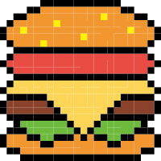

<!-- logo标识，media为我们在docs中创建的素材文件夹 -->

<!-- 以下封面描述 -->

# [DgdgPage](aptv20231225.m3u)

> A nice website for dev

- Quickly build a blog
- User-friendly catalog
- Based on configuration

<!-- 以下为链接，空格分隔 -->
[GitHub](tv/mylive.txt) [DGDG](https://dgdg996.top)  [Get Started](tv/mylist.m3u)

<!-- 这个是封面背景图，不配置的话，是随机的颜色 -->
<!--  -->

<!-- 固定封面背景色，不配置的话，背景是随机的颜色，背景色和背景图只能同时配置一个 -->
<!--  -->