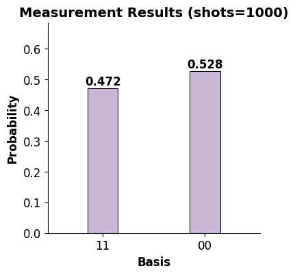
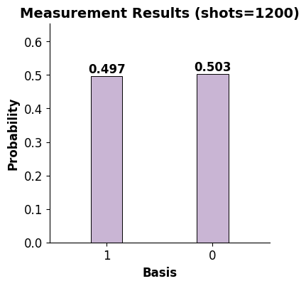
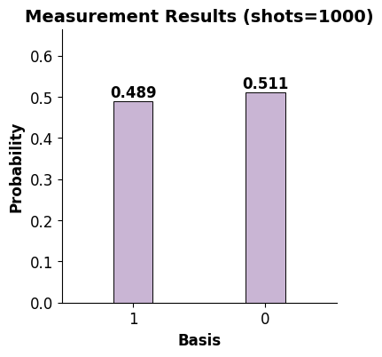

# 第一章 参数化量子线路（样章）

量子计算有几种运算模型，如量子绝热模型、量子线路模型、量子随机行走模型、拓扑量子计算模型等，但在本教材中主要讨论的是量子线路模型。参数化量子线路（PQC）提供了一种在NISQ（Noisy Intermediate-Scale Quantum）时代实现量子算法和混合算法的具体方法，具体来讲，在混合量子-经典体系中，参数化量子线路可以作为一种有着高表达能力的机器学习方法实现数据驱动任务，如监督学习、生成任务等。

## 1.1 量子态

### 1.1.1 态矢量

量子系统中状态表征的是量子系统的统计信息。在数学上，用矢量来表示，即态矢量。量子态本质上是一个概率密度，因此量子态并不直接描述成质量、电荷密度等这样的物理量。

态矢量是希尔伯特空间中的元素，在量子力学中，态矢量有着特殊的符号，即狄拉克（Dirac）符号，也称为右矢（ket），标记为 
$|\psi\rangle$，其中 $\psi$ 仅仅是一个标签。 右矢符号是向量空间的抽象处理，若在有限维度中，就可以理解它为列向量。  

态矢量与概率相关，要对矢量加上某形式的归一化处理。在一般的希尔伯特空间下，要求态矢量的范数等于1  


$$\Vert |\psi\rangle \Vert = 1$$    

与右矢相反的是左矢（bra），数学上，左矢是右矢的共轭转置  


$$\langle\psi| = {|\psi\rangle}^{\dagger}$$  

如果希尔伯特空间是有限维度的实数或复数空间，左矢就对应为行向量，那么就可以表示两个态 $|\phi\rangle$ 和 $|\psi\rangle$ 的内积为  


$$\langle\phi|\psi\rangle$$  

如果我们在量子系统的希尔伯特空间中选择了基矢 $\{|k_i\rangle\}$，那么态矢量 $|\psi\rangle$ 就可以表示成基矢的线性组合  


$$|\psi\rangle = \sum_i \alpha_i |k_i\rangle$$  
其中系数 $\alpha_i$ 为复数，这个求和可以是无限的，这取决于希尔伯特空间的维度是否有限。 $\alpha_i$ 称为概率幅，态矢量的归一化约束条件为  


$$\sum_i {|\alpha_i|}^2 = 1$$  
式中的加和称为态 $\{|k_i\rangle\}$ 的量子叠加，任何加和都是经过重新归一化处理后的叠加。  

量子系统的叠加表示所有理论上可能的态都同时存在于这个系统中，然而在进行测量时，我们只能得到一个结果，获得此结果的概率与对应基矢前的系数（概率幅）有关。 

### 1.1.2 密度矩阵

态的另一种表示是密度矩阵，也被称为密度算符、密度算子。密度矩阵是态矢量的外积形成的矩阵  


$$\rho = |\psi\rangle\langle\psi|$$  
如果一个量子态 $\rho$ 可以用这种形式表示，则这个量子态被称为纯态，纯态是一个确定的态。 

纯态具有以下性质：  
（1）密度矩阵是幂等的：$\rho^2 = |\psi\rangle\langle\psi|\psi\rangle\langle\psi| = |\psi\rangle\langle\psi| = \rho$  
（2）任何标准正交基矢 $\{|n|\}$ 下，密度矩阵的迹为1：
$ 
tr(\rho)= \sum_n\langle n|\rho|n\rangle = \sum_n\langle n|\psi\rangle\langle\psi|n\rangle = \sum_n\langle\psi|n\rangle\langle n|\psi\rangle = 1
$  
（3）由（1）和（2）：$tr(\rho^2) = 1$  
（4）厄米性：$\rho^\dagger = (|\psi\rangle\langle\psi|)^\dagger = |\psi\rangle\langle\psi| = \rho$  
（5）半正定性：
$
\langle\phi|\rho|\phi\rangle = \langle\phi|\psi\rangle\langle\psi|\phi\rangle = \langle\phi|\psi\rangle (\langle\phi|\psi\rangle)^\dagger \geq 0
$

密度矩阵还适用于另外一种类型的态，即混合态。混合态可以看作一组纯态的简单混合，描述了不同纯态的概率分布  


$$\rho_{mixed} = \sum_i p_i |\psi_i\rangle\langle\psi_i|$$  
表示这个混合态以 $p_i$ 的概率处于量子态 $|\psi_i\rangle$。  

混合态具有以下性质：  
（1）不满足幂等性：$\rho_{mixed}^2 \neq \rho_{mixed}$  
（2）$tr(\rho_{mixed}) = 1$  
（3）$tr(\rho_{mixed}^2) < 1$  
（4）厄米性  
（5）半正定 

### 1.1.3 约化密度矩阵

偏迹可以用来从总系统的密度矩阵得到子系统的约化密度矩阵。
假设有两个物理系统$A$和$B$，它们的复合系统的状态由密度矩阵 $\rho_{AB}$描述，设$\{w_i|i=1,2,...,n_b\}$为空间$H_B$的一组基矢，其中$n_b$为空间$H_B$的维度，那么$A$系统的约化密度矩阵为：   


$$\rho_A = tr_B(\rho_{AB})=\sum_{i=1}^{n_b}\langle w_i|\rho_{AB}|w_i\rangle$$  
即，$\rho_{AB}$对子系统$B$求偏迹，得到子系统$A$的约化密度矩阵。  
Kronecker积和偏迹运算可看作两个量子态的复合和分离操作。

## 1.2 量子比特

量子比特（Quantum bit, 简称Qubit）是量子信息的基本单元，是一个二级量子系统。传统计算机的比特（bit）用来储存二进制数字0或1：只有可能是0和1中的一个状态；而量子计算中的量子比特也有两个可能状态 $|0\rangle$ 和 $|1\rangle$，但量子比特的状态不一定只有$|0\rangle$ 或 $|1\rangle$，还有可能是它们的线性组合，即叠加态，例：  


$$
|\psi\rangle = \alpha|0\rangle + \beta|1\rangle
$$   

表示状态以概率 ${|\alpha|}^2$ 处在$|0\rangle$，以概率 ${|\beta|}^2$ 处在 $|1\rangle$，其中 $\alpha$ 和 $\beta$ 为复数，称为概率幅。

上述为单量子比特的情况，那么多量子比特呢？这里用两个量子比特举例介绍。

两个经典比特共有四个可能状态：00，01，10，11；对应的，两个量子比特有四个基矢：$|00\rangle$ ，$|01\rangle$ ，$|10\rangle$ ，$|11\rangle$ ，这两个量子比特的状态处在这四个基态的线性叠加上，记作  

$$|\psi\rangle = {\alpha}_{00}|00\rangle + {\alpha}_{01}|01\rangle + {\alpha}_{10}|10\rangle + {\alpha}_{11}|11\rangle$$

 与单量子比特情况类似，该双量子比特系统的状态以概率 ${|{\alpha}_x|}^2$ 处在 $|x\rangle$ 上（$x = 00, 01, 10, 11$），且概率和为1: 

$$\sum_{x\in\{{0,1\}}^2}{|{\alpha}_x|}^2 = 1,$$
 
 
其中
$\{0,1\}^2$   意味着长度为2，每个字符从0和1中任取的符号串集合。 

## 1.3 量子逻辑门

经典计算和量子计算采用门算符来运算数据。量子门像经典门一样，也将输入态转换成输出态。与经典门不同的是，量子门允许输入叠加态，并且满足幺正性（意味着量子门操作可逆，并且保证量子态的归一性）。每一个量子门都可以用一个幺正矩阵表示，作用在$n$个量子比特上的量子门用一个 $2^n \times 2^n$ 的幺正矩阵表示。量子操作就是量子门，是幺正算符，且一定有另一个算符能完成逆操作。

### 1.3.1 不含参量子门

单比特门作用于单个量子比特，对应的矩阵（算符）大小为 $2\times 2$；  
双比特门作用于两个量子比特，对应的矩阵（算符）大小为 $2^2\times 2^2$；  
以此类推。  

常见的量子门的标记和矩阵形式如下图所示：

```{image} ./Quantum_Logic_Gates.png
:alt: 常见逻辑门
:width: 500px
:align: center
```

数学上，量子门操作即为矩阵作用于量子态上，常见量子门作用如下：  

$\text{Identity gate (I)}$：是单位矩阵，因此不对量子态做任何改变。

$\text{Pauli-X gate (X)}$：类似于经典计算中的非门，作用是翻转 $|0\rangle$为$|1\rangle$，翻转 $|1\rangle$为$|0\rangle$，记作 $\sigma_x$。  

$\text{Pauli-Y gate (Y)}$：作用是将 $|0\rangle$映射到$i|1\rangle$，映射 $|1\rangle$为 $-i|0\rangle$，记作 $\sigma_y$。  

$\text{Pauli-Z gate (Z)}$：作用是保持 $|0\rangle$不变，映射 $|1\rangle$为 $-|1\rangle$，记作 $\sigma_z$，常用于测量。  

$\text{Hadamard gate (H)}$：作用是将$|0\rangle$ 映射为 $\frac{|0\rangle + |1\rangle}{\sqrt{2}}$，$|1\rangle$ 映射为 $\frac{|0\rangle - |1\rangle}{\sqrt{2}}$，$Hadamard$门作用两次后量子比特不变。

$\text{CNOT gate (CX)}$ (Controlled Not Gate，简称受控非门)：作用于双量子比特，当第一个量子比特为 $|1\rangle$ 时（$\text{Controlled}$），翻转第二个量子比特（$\text{Not}$）。
  
$\text{SWAP}$：作用于双量子比特，交换两个量子比特。  

### 1.3.2 含参量子门 

参数化量子线路中的“参数”体现在通过引入含参数的量子逻辑门来构建量子线路，含参量子门这里指旋转门，参数可看作绕某轴的旋转角度。  

$R_x (\theta) = \begin{bmatrix}\cos(\theta /2)&-i\sin(\theta /2)\\-i\sin(\theta /2)&\cos(\theta /2)\end{bmatrix}$，作用于单量子比特，将量子态绕$X$轴旋转 $\theta$。  

$R_y (\theta) = \begin{bmatrix} \cos(\theta/2) & -\sin(\theta/2) \\ \sin(\theta/2) & \cos(\theta/2) \end{bmatrix}$，作用于单量子比特，将量子态绕$Y$轴旋转 $\theta$。   

$R_z (\theta) = \begin{bmatrix} \exp(-i\theta/2) & 0 \\0 & \exp(i\theta/2)
\end{bmatrix}$，作用于单量子比特，将量子态绕$Z$轴旋转 $\theta$，不论参数调整为多少，都不会影响测量概率。

### 1.3.3 通用量子门

经典计算中，与、或、非三种运算可以完成所有的逻辑操作，我们说这三种运算对于经典计算是通用的。  
 
量子计算中，也有类似的说法，如果任意的酉算子都可以通过某几个基本的门的组合来实现或者以任意精度来逼近，就称这组量子门是通用的。  
 
单比特含参量子门 $R_x(\theta)$，$R_y(\theta)$，$R_z(\theta)$和受控非门（$CNOT$）是最常见的通用量子门组合。换言之，用上述门的组合（乘积）可以表示任意酉算子。

## 1.4 封闭量子系统中量子态的演化

一个封闭系统中量子态的演化可以用酉矩阵来表示：一个酉矩阵作用在量子态上可得到经过演化的量子态。  
假设有酉矩阵$U$，对于态矢：  


$$|\psi\rangle = U|\psi_{init}\rangle$$  
对于密度矩阵：  


$$\rho = U\rho_{init} U^{\dagger}$$ 

## 1.5 量子测量

量子的世界与经典的世界存在着信息的隔阂，我们可以通过多个量子比特构成的量子态去储存大量的信息，来进行大规模的、甚至经典计算机无法执行的运算。但是由于我们处在经典世界，我们仍然需要将量子态坍缩到经典比特进行信息的获取，而这个使得量子态坍缩到经典比特来获取信息的过程，就是量子测量。  

纯态量子态为分量基态的叠加，那么当我们对系统进行测量时，量子态也会相应发生变化：坍缩成某个基态。在量子线路设计时，我们最终需要通过测量获得结果，近似获得量子态中所存储的信息。 

量子测量由一组测量算子$\{M_m\}$描述，这些算子作用在被测系统的状态空间上，指标$m$指实验中可能的测量结果，若测量前量子系统的状态为$|\psi\rangle$，则结果$m$发生的可能性为：  


$$p(m) = \langle\psi|M_m^{\dagger}M_m|\psi\rangle$$  
测量后系统状态坍缩为：  


$$\displaystyle
\frac{M_m|\psi\rangle}{\sqrt{\langle\psi|M_m^{\dagger}M_m|\psi\rangle}}
$$  
测量算子满足完备性方程：  


$$\sum_mM_m^\dagger M_m = I$$ 
对任意$|\psi\rangle$，完备性方程可以体现出理论上测量概率和为1：  


$$1 = \sum_mp(m) = \sum_m\langle\psi|M_m^{\dagger}M_m|\psi\rangle$$

根据选择的测量算子的不同，我们常见的测量有计算基测量、投影测量、正定算子测量等。我们下面主要介绍计算基测量与投影测量，并举例量子线路中最常用的投影测量：$Pauli-Z$测量。

### 1.5.1 计算基测量  

当选择量子态的一组计算基构成一组测量算子$\{M_m\}$时，这种方法称为计算基测量。  

设有一个$n$量子比特的量子态，它是$2^n$个基矢的线性叠加，测量它可能得到$2^n$种结果。若对它进行$n$量子比特的计算基测量，如果测量结果为$00\cdot\cdot\cdot0$ ($n$个$0$)，那么代表此$n$量子比特系统的量子态坍缩到了确定量子态$：|00\cdot\cdot\cdot0\rangle$，从$2^n$种情况中得到了$1$种。若对最高位进行$1$量子比特的计算基测量，如果测量结果为$0\cdot\cdot\ \cdot$（最高位确定为$0$，其余无法得知），那么代表此$n$量子比特系统的量子态的一个子系统（最高位）坍缩到了$|0\rangle$，从$2^n$种情况中排除了一半。

#### 1.5.1.1 单量子比特系统的计算基测量  

设有一单量子比特系统，量子态为$|\psi\rangle = a|0\rangle+b|1\rangle$，针对此单量子比特系统，由它的一组计算基$\{|0\rangle, |1\rangle\}$构成一组计算基测量算子$\{M_0=|0\rangle\langle0|, M_1=|1\rangle\langle1|\}$。  

对待测量子态$|\psi\rangle = a|0\rangle+b|1\rangle$进行计算基测量，若要计算测量结果为计算基$0$的概率，则选择计算基$0$对应的测量算子$M_0=|0\rangle\langle0|$进行计算；若要计算测量结果为计算基$1$的概率，则选择计算基$1$对应的计算基测量算子$M_1=|1\rangle\langle1|$进行计算。  

则获得测量结果为$0$（$m=0$）的概率为：  


$$p(0)=\langle\psi|M_0^\dagger M_0|\psi\rangle=|a|^2$$   
测量后量子态坍缩为：  


$$\displaystyle\frac{M_0|\psi\rangle}{|a|}=\displaystyle\frac{a}{|a|}|0\rangle$$

#### 1.5.1.2 多量子比特系统的计算基测量  

以双量子比特为例，设有一双量子比特系统，量子态为$|\psi\rangle = a|00\rangle+b|01\rangle+c|10\rangle+d|11\rangle$，对它进行计算基测量。  

这里包含两种情况：一种是测量所有量子比特，另一种是测量部分量子比特。  

- 情况一：测量所有量子比特  

若对双量子比特系统的量子态$|\psi\rangle = a|00\rangle+b|01\rangle+c|10\rangle+d|11\rangle$进行所有量子比特的测量，由于它有$2^2=4$个计算基，则构建出一组元素数为$4$的测量算子$\{M_{00},M_{01},M_{10},M_{11}\}$，其中$M_{00}=|00\rangle\langle00|，M_{01}=|01\rangle\langle01|，M_{10}=|10\rangle\langle10|，M_{11}=|11\rangle\langle11|$。  

若计算测量结果为计算基$ij$的概率，则选择计算基$ij$对应的计算基测量算子$M_{ij}=|ij\rangle\langle ij|$进行计算，其中$i,j \in \{0,1\}$。  

获得测量结果为$00$（$m=00$）的概率为：  


$$p(00)=\langle\psi|M_{00}^\dagger M_{00}|\psi\rangle=|a|^2$$   
测量后量子态坍缩为：  


$$\displaystyle\frac{M_{00}|\psi\rangle}{|a|}=\displaystyle\frac{a}{|a|}|00\rangle$$  

获得测量结果为$01$（$m=01$）的概率为：  


$$p(01)=\langle\psi|M_{01}^\dagger M_{01}|\psi\rangle=|b|^2$$   
测量后量子态坍缩为：  


$$\displaystyle\frac{M_{01}|\psi\rangle}{|b|}=\displaystyle\frac{b}{|b|}|01\rangle$$ 

我们通过例子来感受一下量子测量，以Bell态为例。我们通过构建一个量子线路来制备一个Bell态：利用一个$Hadamard$门和一个$CNOT$门构建一个酉矩阵，作用在两比特体系的初态$|\psi\rangle = |00\rangle$上，即得到Bell态，然后我们将制备的Bell态进行所有qubits上的计算基测量。由上述内容知识可以手动计算出它的理论值，可以将实际测量结果与理论值比较。


```python
# bell态的制备

from deepquantum import *
import torch
import matplotlib.pyplot as plt


psi = (torch.tensor([[1,0,0,0]])+0.j).T  # 初始态
cir = QubitCircuit(2)
cir.h(0)
cir.cnot([0,1])
U = cir.get_unitary()  
bell = U @ psi
print(bell)
```

    tensor([[0.7071+0.j],
            [0.0000+0.j],
            [0.0000+0.j],
            [0.7071+0.j]])


```python
# 定义一个函数进行测量结果的可视化

def show_prob(rst, shots):
    x = []
    y = []
    for key in rst.keys():
        x.append(key)
        y.append(rst[key]/shots)
    
    fig, ax = plt.subplots(figsize=(4,4))
    ax.bar(x, y, color='#c9b5d4', edgecolor='black', linewidth=0.7, width=0.3)
    ax.margins(0.3)
    # 将y值添加到柱子上方
    for i, v in enumerate(y):
        ax.text(i, v+0.01, f'{v:.3f}', ha='center', fontweight='bold', fontsize=12)

    ax.set_xlabel('Basis', fontweight='bold', fontsize=12)
    ax.set_ylabel('Probability', fontweight='bold', fontsize=12)
    ax.set_title(f'Measurement Results (shots={shots})', fontweight='bold', fontsize=14)

    ax.tick_params(axis='both', which='major', labelsize=12)
    ax.spines['right'].set_visible(False)
    ax.spines['top'].set_visible(False)

    plt.show()
    return
```


```python
# 在所有qubits上进行计算基测量

# 设置抽样次数
shots = 1000 
# 对Bell态进行计算基测量
rst = measure(bell, shots)
# 显示测量结果
show_prob(rst,shots)

```


    

    


- 情况二：测量部分量子比特   

若对双量子比特系统的量子态$|\psi\rangle = a|00\rangle+b|01\rangle+c|10\rangle+d|11\rangle$的第一个量子比特进行测量，由于它有$2^1=2$个计算基，则构建出一组元素数为$2$的测量算子$\{M_{0},M_{1}\}$，其中$M_{0}=|0\rangle\langle0|\otimes I，M_{1}=|1\rangle\langle1|\otimes I$，这里与$I$进行Kronecker积操作是为了将测量算子扩张为适应双量子比特系统的形式。  

对第一个量子比特进行测量，若要计算测量结果为计算基$i$的概率，则选择计算基$i$对应的计算基测量算子$M_{i}=|i\rangle\langle i|\otimes I$进行计算，其中$i \in \{0,1\}$。   

获得第一个量子比特测量结果为$0$（$m=0$）的概率为：  


$$p(0)=\langle\psi|M_{0}^\dagger M_{0}|\psi\rangle=|a|^2+|b|^2$$   
测量后量子态坍缩为：  


$$\displaystyle\frac{M_{0}|\psi\rangle}{\sqrt{|a|^2+|b|^2}}=\displaystyle\frac{a}{\sqrt{|a|^2+|b|^2}}|00\rangle+\displaystyle\frac{b}{\sqrt{|a|^2+|b|^2}}|01\rangle$$  

接下来我们将制备的Bell态进行部分qubits上的计算基测量。由上述内容知识可以手动计算出它的理论值，然后将实际测量结果与理论值比较。


```python
# 对部分比特进行计算基测量

# 对0号qubit进行计算基测量

# 设置抽样次数
shots = 1200
# 设置要测量的比特
q = 0
# 对Bell态的0号位的比特进行计算基测量
rst_q0 = measure(bell, wires=q, shots=shots)
# 展示测量结果
show_prob(rst_q0,shots)

```


    

    


```python
#对1号qubit进行计算基测量

# 设置抽样次数
shots = 1000
# 设置要测量的比特
q = 1
# 对Bell态的1号位的比特进行计算基测量
rst_q1 = measure(bell, wires=q, shots=shots)
# 展示测量结果
show_prob(rst_q1,shots)
```


    

    


### 1.5.2 投影测量  

投影测量用一个可观测量（厄米算子）$M$来描述，$M=M^\dagger$。$M$具有谱分解：$M=\sum_m mP_m$，$m$为$M$的特征值，$P_m$为该特征值的特征空间的投影算子。当选择某可观测量$M$的一组特征值的对应特征空间投影算子作为一组测量算子$\{P_m\}$时，这种方法称为投影测量，测量结果$m$为特征值。   

投影测量算子$\{P_m\}$满足：  
$1)\ \sum_mP_m^\dagger P_m=I$，即完备性方程；   
$2)\ P_m^\dagger=P_m$，即厄米算子；  
$3)\ P_mP_{m'}=\delta_{mm'}P_m$，即正交性；  
后面两条体现了$\{P_m\}$是正交投影算子。  

设一量子态$|\psi\rangle$，对它进行投影测量，得到测量结果为特征值$m$的概率为：  


$$p(m)=\langle\psi|P_{m}^\dagger P_{m}|\psi\rangle=\langle\psi|P_{m}|\psi\rangle$$   
测量后，量子态坍缩为：  


$$\displaystyle\frac{P_{m}|\psi\rangle}{\sqrt{p(m)}}$$  

我们可以这样解释：对状态$|\psi\rangle$进行$M$投影测量，相当于将$|\psi\rangle$向$M$的特征空间投影，有$p(m)$的概率投影到特征空间$V_m$上，此时测量结果为该特征空间的特征值$m$。

投影测量的一个重要特点就是很容易计算投影测量的可观测量的期望值$E(M)$：  


$$E(M)=\sum_m mp(m)=\sum_m m\langle\psi|P_{m}|\psi\rangle = \langle\psi|\sum_m mP_{m}|\psi\rangle = \langle\psi|M|\psi\rangle$$

#### 1.5.2.1 Pauli 测量  

若投影测量选择了$Pauli$算子作为可观测量$M$，那么称此投影测量为$Pauli$测量。$Pauli-Z$测量是量子线路模型中最常见的测量方法，即选择$Pauli-Z(Z)$算子作为可观测量。  

$Z = \begin{bmatrix}1&0 \\ 0&-1\end{bmatrix}$
的特征值为$1,-1$，那么有谱分解：  

$$Z=m_1P_1+m_{-1}P_{-1}=1\times|0\rangle\langle0|+(-1)\times|1\rangle\langle1|$$  

$Pauli-Z$测量的含义为：  
若测量结果为$1$，则代表量子态被投影到了$1$的特征空间中成为了$|0\rangle\langle0|$；
若测量结果为$-1$，则代表量子态被投影到了$-1$的特征空间中成为了$|1\rangle\langle1|$。

$Pauli-Z$测量举例：  

设有一待测量子态：$|\psi\rangle=\displaystyle\frac{\sqrt{2}}{2}|00\rangle+\displaystyle\frac{\sqrt{2}}{2}|11\rangle$，对它的第一个量子比特进行$Pauli-Z$测量：  

因为这是一个双量子比特系统，所以需要对可观测量$Pauli-Z$进行扩张：  

$$M=Z\otimes I$$  

带入计算可观测量期望值：  

$$E(M)= \langle\psi|Z\otimes I|\psi\rangle=0$$  

可得出

$$E(M)=0=m_1p_1+m_{-1}p_{-1}$$  
因为$p_1+p_{-1}=1$，所以计算得到$p_1=0.5，p_{-1}=0.5$，即：对$|\psi\rangle$的第一个量子比特进行$Pauli-Z$测量，有$0.5$的概率测得结果为$m=1$，有$0.5$的概率测得结果为$m=-1$，期望为$0$。 


接下来我们将制备的Bell态进行部分qubits上的PauliZ测量的期望值计算。


```python
# 对0号qubit进行PauliZ测量的期望值的计算

# 设置观测量为PauliZ，设置对0号位的量子比特进行测量
ob = Observable(nqubit=2, wires=[0], basis='z')
# 进行测量，并得到结果
expectation(bell,ob)
```


    tensor(0.)


